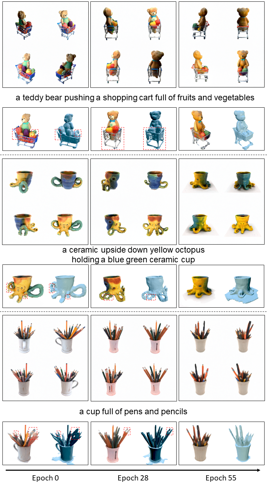
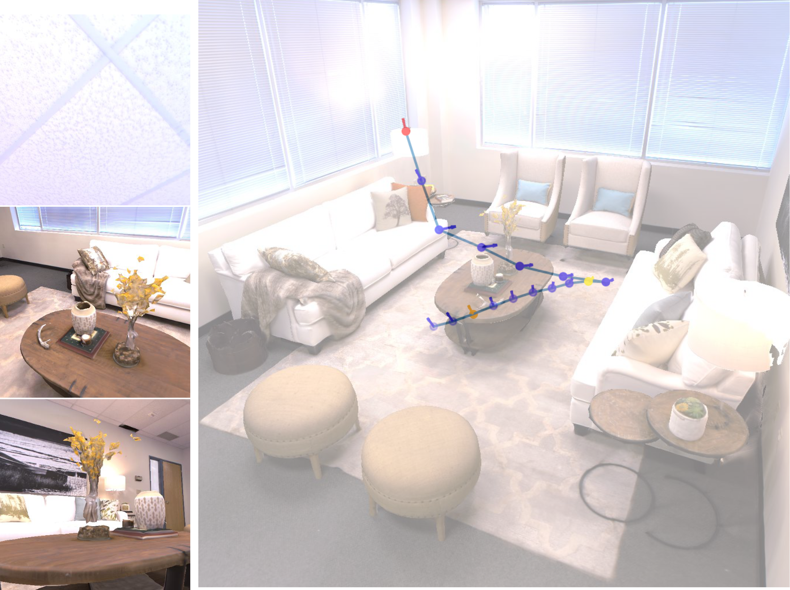

Hi there! 
I am a 5th-year CS PhD candidate at [Stony Brook University](https://www.stonybrook.edu/), advised by [Prof. Arie Kaufman](https://www3.cs.stonybrook.edu/~ari/). 
Currently, I am a student researcher at [ByteDance Seed](https://team.doubao.com/en/), working on video generation with [Peng Wang](https://pengwangucla.github.io/peng-wang.github.io/) and [Yichun Shi](https://seasonsh.github.io/).
Previously, I interned in the Video AI group at [Adobe Research](https://research.adobe.com/) in Summer 2024, working on video generation with [Yang Zhou](https://yzhou359.github.io/) and [Prof. Feng Liu](https://pages.cs.wisc.edu/~fliu/).
I was a research intern in the 3D group at [Adobe Research](https://research.adobe.com/) in Summer 2023, working with [Xin Sun](https://www.sunxin.name/) and [Hao Tan](https://www.cs.unc.edu/~airsplay/).
Prior to joining SBU, I spent 3 years at [Lehigh University](https://www2.lehigh.edu/) for my undergraduate CS education, where I worked on protein volume classification with [Prof. Brian Chen](https://www.cse.lehigh.edu/~chen/).

I am broadly interested in visual generative models, large-scale training, and Reinforcment Learning (RL).
In my research, I often take a **scalability** perspective (e.g. [the Bitter Lesson](http://www.incompleteideas.net/IncIdeas/BitterLesson.html)): 
- [Progressive Autoregressive Video Diffusion Models](https://desaixie.github.io/pa-vdm/) introduces a new noise schedule and sampling algorithm that seamlessly model long videos with regular context length; otherwise, long videos are computationally infeasible to diffusion modeling directly.
- [Carve3D](https://desaixie.github.io/carve-3d/) uses RL with feedback from 3D reconstruction to circumvent real 3D data
- [LRM-Zero](https://desaixie.github.io/lrm-zero/) introduces large-scale procedural 3D data synthesis to address 3D data scarcity.

-----

News
======

**03/24/2025** Started internship at [ByteDance Seed](https://team.doubao.com/en/), working on video generation.

**10/10/2024** [Progressive Autoregressive Video Diffusion Models](https://desaixie.github.io/pa-vdm/) is released on arXiv! Proud to build the first video generation model that can autoregressively generate 60-second videos without quality degradation over time!

**09/25/2024** [LRM-Zero](https://desaixie.github.io/lrm-zero/) is accepted to [NeurIPS 2024](https://neurips.cc/)! 

**06/17/2024** Attended [CVPR 2024](https://cvpr.thecvf.com/Conferences/2024) in Seattle, WA. I presented [Carve3D](https://desaixie.github.io/carve-3d/) and was glad to see [LRM-Zero](https://desaixie.github.io/lrm-zero/) being featured in two workshop invited talks ([3DFM](https://3dfm.github.io/) and [SyntaGen](https://syntagen.github.io/)) by [Hao Tan](https://www.cs.unc.edu/~airsplay/) and [Nathan Carr](https://research.adobe.com/person/nathan-carr/)!

**06/13/2024** [LRM-Zero](https://desaixie.github.io/lrm-zero/) is released on arXiv! First time working on large-scale pre-training and data generation, and it was a blast!

**05/28/2024** Started my second internship at [Adobe Research](https://research.adobe.com/), this time working on video generation!

**02/26/2024** [Carve3D](https://desaixie.github.io/carve-3d/) is accepted to [CVPR 2024](https://cvpr.thecvf.com/Conferences/2024)! 

**07/17/2023** [GAIT](https://desaixie.github.io/gait-rl/) is accepted to [ICCV 2023](https://iccv2023.thecvf.com/)! 

**06/19/2023** Started my internship at [Adobe Research](https://research.adobe.com/)!

-----

Publications
======

  

**Progressive Autoregressive Video Diffusion Models**  
**Desai Xie**, Zhan Xu, Yicong Hong, Hao Tan, Difan Liu, Feng Liu, Arie Kaufman, Yang Zhou  
*arXiv 2024*  
[Project](https://desaixie.github.io/pa-vdm/){: .btn}  [Paper](https://arxiv.org/abs/2410.08151){: .btn}  [Code](https://github.com/desaixie/pa_vdm){: .btn}

  

**LRM-Zero: Training Large Reconstruction Models with Synthesized Data**  
**Desai Xie**, Sai Bi, Zhixin Shu, Kai Zhang, Zexiang Xu, Yi Zhou, Sören Pirk, Arie Kaufman, Xin Sun, Hao Tan  
*NeurIPS 2024*  
[Project](https://desaixie.github.io/lrm-zero/){: .btn}  [Paper](https://arxiv.org/abs/2406.09371){: .btn}  [Code](https://github.com/desaixie/zeroverse){: .btn}

  

**Carve3D: Improving Multi-view Reconstruction Consistency for Diffusion Models with RL Finetuning**  
**Desai Xie**, Jiahao Li, Hao Tan, Xin Sun, Zhixin Shu, Yi Zhou, Sai Bi, Sören Pirk, Arie E. Kaufman  
*Conference on Computer Vision and Pattern Recognition (CVPR), 2024*  
[Project](https://desaixie.github.io/carve-3d/){: .btn}  [Paper](https://arxiv.org/abs/2312.13980){: .btn}  [Code](https://github.com/desaixie/carve3d){: .btn}

  

**GAIT: Generating Aesthetic Indoor Tours with Deep Reinforcement Learning**  
**Desai Xie**, Ping Hu, Xin Sun, Sören Pirk, Jianming Zhang, Radomír Měch, Arie E. Kaufman  
*International Conference on Computer Vision (ICCV), 2023*  
[Project](https://desaixie.github.io/gait-rl/){: .btn}  [Paper](https://openaccess.thecvf.com/content/ICCV2023/papers/Xie_GAIT_Generating_Aesthetic_Indoor_Tours_with_Deep_Reinforcement_Learning_ICCV_2023_paper.pdf){: .btn}  [Code](https://github.com/desaixie/gait){: .btn}

-----

Misc
=====
A fun fact about my name is that De (德) and Sai (赛) means demoncracy and science in Chinese ([Wikipedia](https://en.wikipedia.org/wiki/New_Culture_Movement#Chen_Duxiu)).

I love training my "Catificial" Intelligence/CatGPT🐈 agent, **Purrari**, using a blend of supervised learning (instruction finetuning) and RL (treats as positive reward). 
She understands many words in both English and Mandarin and has mastered numerous tricks. 
Currently, she is advancing her communication skills through pet talking buttons. 
For more cute cat pics and videos, please visit [her instagram](https://www.instagram.com/purrari_0310/), lovingly maintained by her mom.
